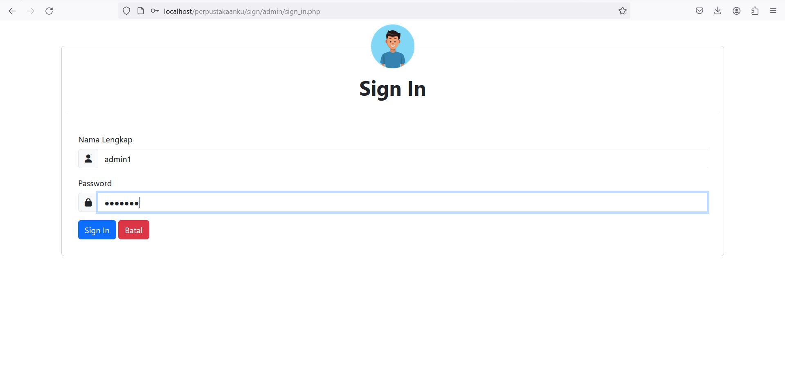
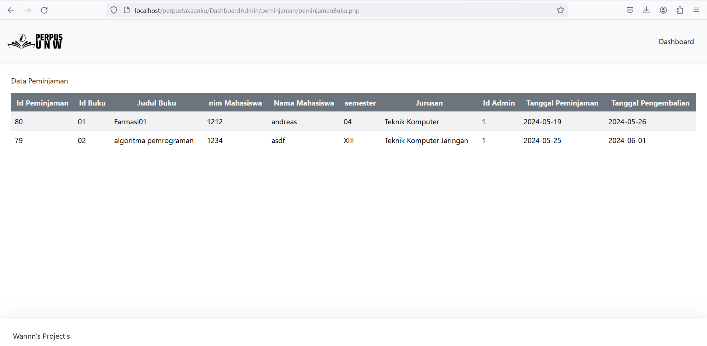

# Sistem Perpus Universitas Ngudi Waluyo
<h4>Nama Project ini adalah : Perpus.UNW</h4>
 

 

website ini dibuat menggunakan framework bootstrap, javascript, php dan database mysql.

Fitur fitur yang terdapat didalam aplikasi ini : 
<ul>
<li>Memiliki 2 akses login, admin dan user/mahasiswa .</li>
<li>Akses sebagai admin mendapatkan fasilitas berupa : insert, update dan delete data buku, mencari buku berdasarkan judul dan kategori, mengelola data mahasiswa yang daftar pada aplikasi, mengelola setiap peminjaman buku, mengelola setiap pengembalian buku, menerapkan denda jika mahasiswa/user terlambat mengembalikan buku sesuai jadwal yang ditentukan.</li>
<li>Akses sebagai mahasiswa mendapatkan fasilitas berupa : dapat melihat isi seluruh buku yang ada dalam perpustakaan dan terdapat fitur filter buku berdasarkan kategori. meminjam buku, mengembalikan buku, membayar denda</li>
</ul>
# Berikut adalah tampilan dari website saya

<h3>Halaman Awal</h3>

 
<h3>Halaman Memilih Role</h3>

 
<h2>Tampilan Admin</h2>
 
<h3>Halaman LogIn Admin</h3>

 
<h3>Halaman Dashboard Admin</h3>

 
<h3>Halaman Member</h3>

 
<h3>Halaman Buku</h3>

 
<h3>Halaman Peminjaman</h3>

 
<h3>Halaman Pengembalian</h3>

 
<h3>Halaman Denda</h3>

 
<h2>Tampilan User</h2>
 
<h3>Halaman LogIn</h3>

 
<h3>Halaman Dashboard</h3>

 
<h3>Halaman Daftar Buku</h3>

 
<h3>Halaman Peminjaman</h3>

 
<h3>Halaman Pengembalian</h3>

 
<h3>Halaman Denda</h3>

